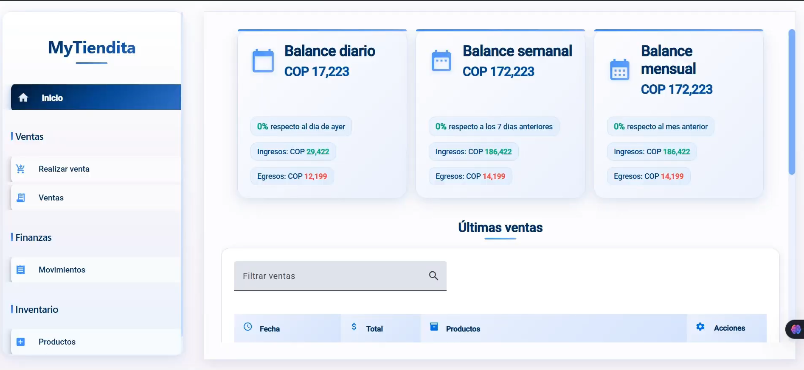
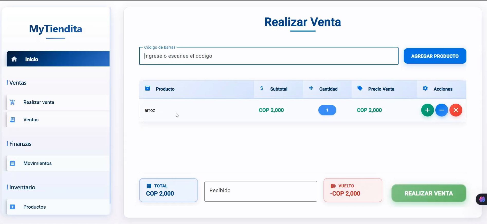
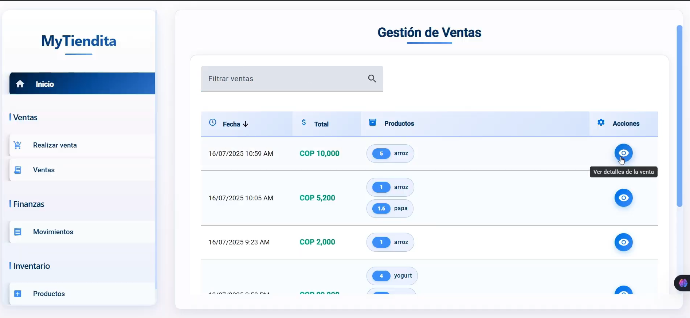
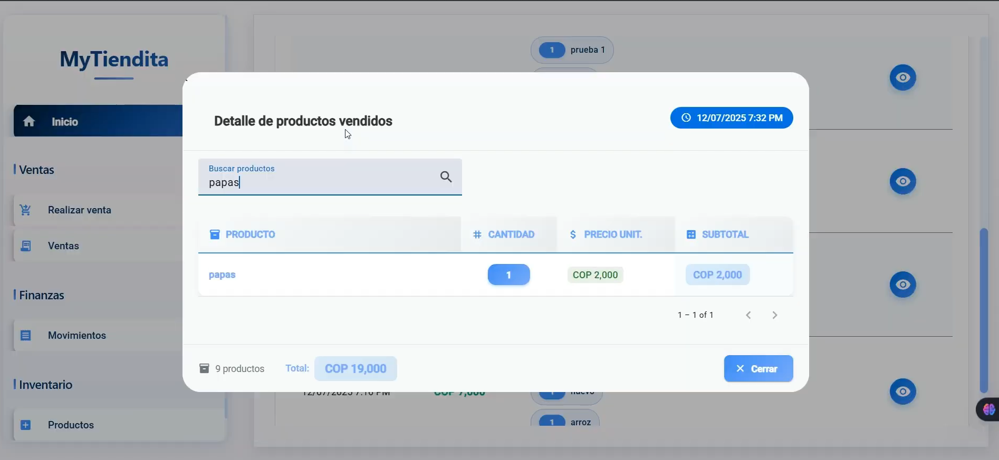
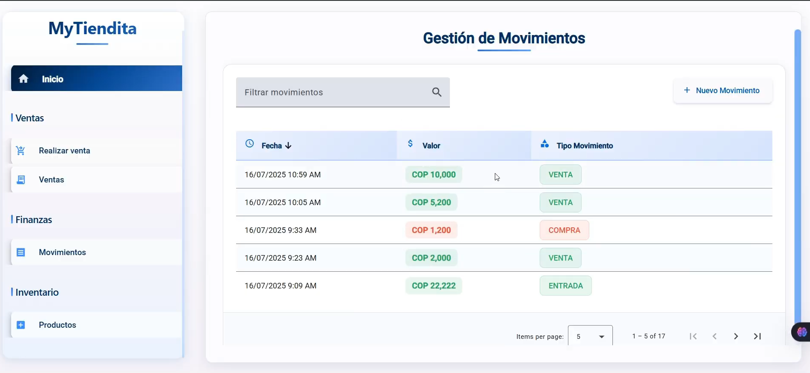
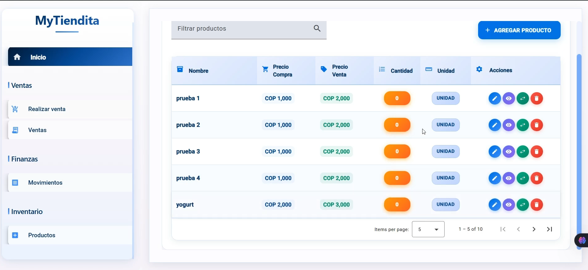

# MyTiendita

---

## 📋 Descripción

**MyTiendita** es una solución integral de software para administrar pequeños negocios. Facilita el control de inventario, gestión de ventas y movimientos de productos de manera simple e intuitiva. Diseñado para pequeños comerciantes que buscan optimizar sus operaciones sin complejidades innecesarias.

---

## 🛠 Tecnologías Utilizadas

---

## 📁 Estructura del Proyecto

- **Backend**: API REST desarrollada con Spring Boot y Java
- **Frontend**: Interfaz moderna con Angular y TypeScript
- **Base de Datos**: PostgreSQL para almacenamiento de datos
- **Configuración**: Scripts de deployment automatizado con Docker

---

## 🚀 Características

- Gestión de productos e inventario
- Control de ventas y movimientos
- Interfaz intuitiva y responsiva
- Pantalla de roportes

---

## 📝 Notas

Proyecto de administración diseñado con simplicidad en mente.

## 🖼️ Imagenes

